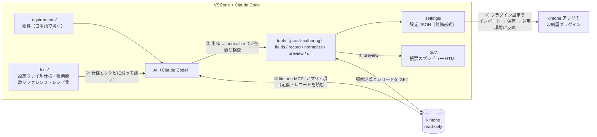

# 印刷屋プラグイン — AI 設定オーサリング環境

**kintone プラグイン「印刷屋プラグイン（rex0220 Print craft）Ver.6」の設定 JSON を、AI（Claude Code + kintone 公式 MCP + tools）に作らせる**ためのテンプレートです。

要件を文章で伝えると、AI が**実アプリの項目定義と実データを確かめながら**帳票の HTML / CSS / 計算式を組み、設定画面でインポートできる設定 JSON を `settings/` に生成します。tools が派生値を生成し、設定を検査し、帳票の HTML をプレビューします。設定は git で履歴管理できます。



> 印刷屋プラグイン本体（Ver.6 以降）は別途入手してください。製品紹介: https://qiita.com/rex0220/items/9be2d9b20a3a1f016c76
> tools は npm パッケージ `@rex0220/print-craft-authoring-tools`（このリポジトリの `tools/` がソース。利用者がビルドする必要はありません）

## 前提

- Node.js 20 以上
- VSCode + [Claude Code](https://claude.com/claude-code)（サブスクリプションが必要）
- kintone の API トークン（対象アプリの**レコード閲覧**権限だけ。推奨）、またはログインユーザー（2 要素認証なし）
- 印刷屋プラグイン Ver.6 以降が対象アプリに入っていること。**その zip ファイル（`print-craft-plugin6.zip` など、アプリに入れたものと同じ版）を手元に置く**。tools は計算式エンジンと印刷屋のコードをこの zip から読みます（tools 自体には含まれません。無ければ配布元から取り直してください）

## セットアップ（7 ステップ）

1. **リポジトリを作る** — このページ右上の **Use this template → Create a new repository** → 自分のアカウントに **private** で作成 → clone
   （設定 JSON にはアプリ番号・項目コード・業務用語が、`records/` にはレコードの値が入ります。**public にしないでください**。作成画面の visibility は **Public が初期値**なので必ず Private に切り替えます）

   [GitHub CLI](https://cli.github.com/) があれば 1 行で:
   ```
   gh repo create print-craft-settings --template rex0220/print-craft-authoring --private --clone
   ```
2. **依存を入れる**
   ```
   npm ci
   ```
   tools（`pcraft-authoring`）と kintone 公式 MCP サーバー（`@kintone/mcp-server`）が入ります。
3. **認証情報を置く** — `.env.example` をコピーして `.env` を作り、接続先と認証を書きます:
   ```
   KINTONE_BASE_URL=https://<自分の環境>.cybozu.com
   KINTONE_API_TOKEN=<対象アプリのレコード閲覧だけの API トークン>
   ```
   - API トークンは**アプリ単位**です: アプリの設定 → カスタマイズ/サービス連携 → API トークン → 生成 → アクセス権は**「レコード閲覧」のみ** → 保存 → **アプリを更新**。複数アプリはカンマ区切り（最大 9 個）
   - 項目定義とレイアウト（`/k/v1/app/form/fields`、`/k/v1/app/form/layout`）はレコード閲覧権限のトークンで読めます
   - ログインユーザーで認証するなら `KINTONE_USERNAME` / `KINTONE_PASSWORD`（2 要素認証なしのアカウント）。**トークンとユーザーの両方は書かない**（MCP はユーザーを、tools はトークンを使うので食い違います）
   - OS の環境変数でも指定できます（OS の環境変数が優先。設定後は VSCode を完全に再起動）
   - 同じ `.env` に印刷屋プラグインの zip の場所を書きます:
     ```
     PCRAFT_PLUGIN_ZIP=C:/Users/you/Downloads/print-craft-plugin6.zip
     ```
4. **VSCode で開いて Claude Code を起動** — 初回に kintone MCP サーバーの使用可否を聞かれるので許可します（登録内容は `.mcp.json`）。以後、kintone の**読み取り**と `settings/` などへの**ファイル保存**は確認なしで進みます（同梱の `.claude/settings.json` で許可済み。kintone への**書き込みツールは拒否**しています）
5. **疎通確認** — ターミナルで `npx pcraft-authoring version`（tools の版と、zip から読んだ印刷屋の版・計算式エンジンの SHA-256 が出る。zip が読めない・版が合わないとここで止まる）。Claude Code に「kintone-get-apps を実行して」と頼んでアプリ一覧が返れば準備完了です
6. **作る** — `requirements/` に要件を書くか（例: [requirements/example.md](requirements/example.md)）、そのままチャットで伝えます:
   ```
   アプリ 3740（見積書）に、A4 縦の見積書を作って見積ファイルに保存するボタンを作って
   ```
   AI が `fields/<app>.json` を取り、帳票を組み、`npx pcraft-authoring normalize` で検査して `settings/` に設定 JSON（封筒形式）を保存し、`npx pcraft-authoring preview` で `out/<ボタン名>.html` を作ります。**Chrome で開いて見た目を確かめてください**（近似。画像はダミー。Web フォントは配信元が承認済みのときだけ読みます。Google Fonts は既定で承認、他は `policy/authoring-policy.json` に書きます）
   - **アプリはできるだけ番号で指定**してください（番号はアプリの URL `/k/番号/` に出ています）
   - 保存先の添付ファイル項目、用紙、向き、ボタンを押したときの動き（プレビュー / 確認 / すぐに作成）を伝えると早いです
7. **反映する** — アプリの設定 → プラグイン → 印刷屋プラグインの設定 → **ツール → インポート** → `settings/` のファイルを選ぶ → **保存する** → アプリの設定を**運用環境に反映** → 詳細画面でボタンを押して PDF を確かめる。検証に失敗した場合、既存の設定は変わりません

## 設定ファイルの管理ルール（settings/）

- **固定名で上書き保存**し、履歴は git の diff で追う（日時付きファイル名を増やさない）
- **git が正** — 設定画面で直したら、エクスポートして `settings/` へ戻し、`npx pcraft-authoring normalize <ファイル> --fields fields/<app>.json --check` で派生値が一致することを確かめてコミットする
- 常に**封筒形式**（`date` / `pluginName` / `pluginID` / `PluginVersion` / `appId` / `appName` + 設定本体）
- 反映の前に `npx pcraft-authoring diff <前> <後>` で差分（HTML / CSS / 計算式）を見る
- `records/` と `out/` はレコードの値を含みます。コミットしません（`.gitignore` 済み）

## tools のコマンド

| コマンド | 内容 |
| :--- | :--- |
| `npx pcraft-authoring fields --app N` | 項目定義・レイアウト・アプリ名を `fields/N.json` に |
| `npx pcraft-authoring record --app N --id R --fields-from settings/<ファイル>.json` | プレビュー用のレコードを `records/N-R.json` に（設定が使う項目だけ） |
| `npx pcraft-authoring normalize settings/<ファイル>.json --fields fields/N.json` | 派生値の生成と検査。エラーがあれば書き戻さない。`--check` で派生値の差、`--dry-run` で書かない |
| `npx pcraft-authoring preview settings/<ファイル>.json --fields fields/N.json --record records/N-R.json` | ボタンごとの帳票 HTML を `out/` に |
| `npx pcraft-authoring diff <前.json> <後.json>` | 既存設定の変更の差分 |
| `npx pcraft-authoring version` | tools の版と、zip から読んだ印刷屋の版・authoring API の版・計算式エンジンの SHA-256 |

kintone には **GET しか送りません**。計算式エンジン（`KintoneFormulaPCraft.min.js`）と印刷屋の設定画面・帳票のコード（`print-craft-authoring-api.js`）は、tools には含まれず、`.env` の `PCRAFT_PLUGIN_ZIP` の zip から実行のたびに読みます（コピーも書き出しもしません。印刷屋プラグインの利用規約に従います）。

## テンプレートの更新を取り込む

印刷屋プラグインの新機能に合わせて、このテンプレートの docs/ と tools の版は更新されます。取り込みたいときは:

```
git remote add template https://github.com/rex0220/print-craft-authoring.git   # 初回のみ
git fetch template
git merge template/main --allow-unrelated-histories
npm ci
```

- 自分の `settings/` `requirements/` `fields/` `policy/` と `.env` はそのまま残ります。衝突が出るのは、テンプレート由来のファイル（docs/、README、CLAUDE.md）を自分で編集した場合だけです
- テンプレート側は `settings/` に README.md 以外、`requirements/` に example.md 以外、`policy/` に README.md と空の `authoring-policy.json` 以外のファイルを追加しません
- tools の版の先頭は対応する印刷屋プラグインの版（`6.x.y` = Ver.6）。印刷屋を上げたらテンプレートも取り込み、`npx pcraft-authoring version --expect <版>` で確かめます

## ドキュメント

| ファイル | 内容 |
| :--- | :--- |
| [docs/設定ファイル仕様.md](docs/設定ファイル仕様.md) | 設定 JSON の形式の**正本**（キー、誰が書くか、列挙、制約、検査すること / しないこと） |
| [docs/帳票関数リファレンス.md](docs/帳票関数リファレンス.md) | 帳票の評価の流れ、置き換えタグ、印刷屋固有の関数と**エスケープの扱い** |
| [docs/帳票レシピ集.md](docs/帳票レシピ集.md) | 帳票の書き方（既定の形）とレシピ |
| [docs/関数一覧.md](docs/関数一覧.md) | 使える計算式の関数 243 個。例は [関数の使い方（計算式プラグインの記事）.md](docs/関数の使い方（計算式プラグインの記事）.md)、詳細は [関数リファレンス（詳細）.md](docs/関数リファレンス（詳細）.md) |
| [docs/AI設定オーサリング手順.md](docs/AI設定オーサリング手順.md) | 作業手順の詳細と、AI への指示の例 |
| [docs/samples/](docs/samples/) | 動作確認済みの実例（雛形にどうぞ） |
| [CLAUDE.md](CLAUDE.md) | AI への常設指示（このリポジトリを開いた Claude Code が自動で読みます） |
| [policy/README.md](policy/README.md) | 外部 URL の承認（利用者が書く） |

## トラブルシュート

| 症状 | 確認すること |
| :--- | :--- |
| MCP サーバーが起動しない | Node.js 20 以上か（`node -v`）。`npm ci` 済みか。`.env` を作ったか |
| `KINTONE_BASE_URL が無い` | `.env` の場所（リポジトリのルート）と変数名。OS の環境変数を設定したなら VSCode を完全に再起動 |
| `印刷屋の zip の場所が分からない` / `版 … には対応していない` | `.env` の `PCRAFT_PLUGIN_ZIP` のパス。zip の版（manifest の version）が tools の対応する版（`npx pcraft-authoring version`）と合うか。Ver.5 以前の zip には authoring API が無い |
| `印刷屋の zip の中身が tools の既知の一覧と違う` | zip を配布元から取り直す。印刷屋の修正版が出て tools がまだ追いついていないなら、tools を更新するか、分かった上で `.env` に `PCRAFT_ALLOW_UNKNOWN_PLUGIN=1` を書く（利用者だけ） |
| `KINTONE_BASE_URL が不正` / `kintone のドメインではない` | `https://<サブドメイン>.cybozu.com` の形だけ（`.kintone.com` / `.cybozu.cn` も可）。パス・ポート・`@` を付けない |
| `書き込み先は settings/ か temp/ の下` / `作業フォルダーの中` | tools が書くのは `fields/` `records/` `settings/` `temp/` `out/` の下だけ。`docs/samples/` のファイルは読めるので、`normalize docs/samples/見積書/settings.json --fields docs/samples/見積書/fields.json --dry-run` で確かめるか、`--out temp/見積書.json` か `settings/` にコピーして使う |
| `iframe の src は利用者の kintone（… 未設定 …）` | 帳票に kintone のグラフの iframe を入れるには `.env` の `KINTONE_BASE_URL` が要る（fields の値では判定しない） |
| `計算式の文字列の中に // がある` | 印刷屋は計算式の文字列の中でも `//` 以降をコメントとして捨てる。URL は HTML の属性か `##目印##` に置く |
| `HTTP 401` / `403` | トークンのアプリと権限（レコード閲覧）。トークン生成後に**アプリを更新**したか。ログインユーザーなら 2 要素認証が無効か |
| `PluginVersion は tools が対応する 6` | 設定 JSON の `PluginVersion` と tools の版が合っていない。`npx pcraft-authoring version` |
| `normalize` のエラーが消えない | 文言の規則名（`html.rule`、`calc.ineligible` など）を AI に伝える。[docs/設定ファイル仕様.md](docs/設定ファイル仕様.md) 8 章 |
| インポートで「設定ファイルの内容が不正です」 | 封筒形式か、`pluginID` が合っているか。`normalize` を通したファイルか |
| プレビューと実際の PDF が違う | プレビューは近似（画像はダミー。Web フォントは承認済みの配信元だけ読み、未承認なら OS の書体）。PDF は印刷屋で確かめる |

## セキュリティ

- このテンプレートは kintone を**読み取り専用**で使います。書き込みは 3 層で防いでいます:
  ① [CLAUDE.md](CLAUDE.md) で書き込みツールの使用を禁止
  ② `.claude/settings.json` で kintone MCP の書き込みツール（レコード・フォーム・アプリ・スペースの追加 / 更新 / 削除、ファイルのダウンロード）と、帳票の設定に要らない読み取りツール（検索・スペース・レコードのコメント）を**拒否**（1.8.2 の 26 ツールのうち、許可 8・拒否 18）
  ③ tools は GET しか送らず、呼べる API と送信先（`*.cybozu.com` / `*.kintone.com` / `*.cybozu.cn`）を固定（`npm pack` の中身で確かめられます）
- サーバー側から担保したい場合は、**レコード閲覧だけの API トークン**を使ってください（推奨の構成）
- 認証情報は `.env`（コミット対象外）のみに置く。AI は `.env` と `policy/` を編集しません。tools が読む `.env` と `policy/authoring-policy.json` と印刷屋の zip の場所はこのフォルダーのものに固定で、AI がオプションで別のファイルを指定することはできません。tools が書くのは `fields/` `records/` `settings/` `temp/` `out/` の下だけです
- 印刷屋の zip の中身（計算式エンジンなど 4 ファイル）は tools が知っている SHA-256 と一致しなければ**実行せずに止まります**（改変された zip や、tools より新しい修正版の zip）。新しい修正版だと分かっていて続けるときだけ、利用者が `.env` に `PCRAFT_ALLOW_UNKNOWN_PLUGIN=1` を書きます（zip の中のコードはこの PC の権限で動きます。配布元から入手した zip だけを使ってください）
- 帳票の HTML / CSS / 計算式は、インポートすると印刷屋プラグインが使います。印刷屋 Ver.6 は帳票の HTML / CSS から kintone 以外への読み込み（画像・CSS・iframe・リンク）とスクリプトを**描画の前に除きます**（共通の設定「外部参照」。新しい設定の既定 `externalRefs: "block"`。Ver.5 で保存した設定は「許可」のまま動く）。`normalize` は**許可した要素と属性だけ**を通し（文章・表・画像の要素。インラインの `<svg>` は不可で、図は ``）、スクリプト、イベント属性、`javascript:` の URL、CSS の `@import` / `expression(` などを**エラーで止め**、「除く」の設定の外部 URL もエラー（帳票に出ない）にします。「許可」（何も除かない。自己責任）の設定と、`externalRefs` の無い既存の設定は、利用者が `policy/authoring-policy.json` の `allowExternalRefs` に書かなければエラーです。「許可」の設定の外部 URL と Google Fonts 以外の Web フォントは**警告**（承認は `allowExternal`。承認した URL は情報として出ます）。計算式が作る HTML は警告だけです。警告は書き戻しを止めないので、**インポート前に差分を人が見る**運用にしてください
- `records/` と `out/` にはレコードの値が入ります。作業が終わったら消し、リポジトリは private に
- 脆弱性の報告先と、tools が守ること・利用者が守ることの一覧は [tools/SECURITY.md](tools/SECURITY.md)

## ライセンス

- このリポジトリ（テンプレート、文書、tools のソース）と npm パッケージ `@rex0220/print-craft-authoring-tools` は MIT License
- 印刷屋プラグインの zip の中身（計算式エンジン、設定画面・帳票のコード）は印刷屋プラグインの利用規約に従います。tools はそれらを含まず、利用者の zip から実行時に読むだけです
- 同梱・依存する第三者のソフトウェア（moment、happy-dom）は `tools/THIRD_PARTY_NOTICES.md`
