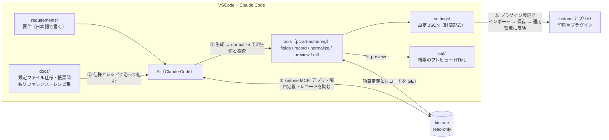

# 印刷屋プラグイン — AI 設定オーサリング環境

**kintone プラグイン「印刷屋プラグイン（rex0220 Print craft）Ver.6」の設定 JSON を、AI（Claude Code + kintone 公式 MCP + tools）に作らせる**ためのテンプレートです。

要件を文章で伝えると、AI が**実アプリの項目定義と実データを確かめながら**帳票の HTML / CSS / 計算式を組み、設定画面でインポートできる設定 JSON を `settings/` に生成します。tools が派生値を生成し、設定を検査し、帳票の HTML をプレビューします。設定は git で履歴管理できます。



> 印刷屋プラグイン本体（Ver.6 以降）は別途入手してください。製品紹介: https://qiita.com/rex0220/items/9be2d9b20a3a1f016c76
> tools は npm パッケージ `@rex0220/print-craft-authoring-tools`（このリポジトリの `tools/` がソース。利用者がビルドする必要はありません）

## 前提

- Node.js 20 以上
- VSCode + [Claude Code](https://claude.com/claude-code)（サブスクリプションが必要）
- kintone のログインユーザー（パスワード認証。**2 要素認証なし**のアカウント。閲覧専用のアカウントがあればベスト）。運用では対象アプリの**レコード閲覧**権限だけの API トークンも使えます（下の 3）
- 印刷屋プラグイン Ver.6 以降が対象アプリに入っていること。**その zip ファイル（`print-craft-plugin6.zip` など、アプリに入れたものと同じ版）を手元に置く**。tools は計算式エンジンと印刷屋のコードをこの zip から読みます（tools 自体には含まれません。無ければ配布元から取り直してください）

## セットアップ（7 ステップ）

1. **リポジトリを作る** — このページ右上の **Use this template → Create a new repository** → 自分のアカウントに **private** で作成 → clone
   （設定 JSON にはアプリ番号・項目コード・業務用語が、`records/` にはレコードの値が入ります。**public にしないでください**。作成画面の visibility は **Public が初期値**なので必ず Private に切り替えます）

   [GitHub CLI](https://cli.github.com/) があれば 1 行で:
   ```
   gh repo create print-craft-settings --template rex0220/print-craft-authoring --private --clone
   ```
2. **依存を入れる**
   ```
   npm ci
   ```
   tools（`pcraft-authoring`）と kintone 公式 MCP サーバー（`@kintone/mcp-server`）が入ります。
3. **認証情報を置く** — `.env.example` をコピーして `.env` を作り、接続先と印刷屋プラグインの zip の場所を書きます（`.env` は必ず作ります。kintone MCP は `.env` を読んで起動します）:
   ```
   KINTONE_BASE_URL=https://<自分の環境>.cybozu.com
   PCRAFT_PLUGIN_ZIP="C:\Users\you\Downloads\print-craft-plugin6.zip"
   ```
   zip の場所は、エクスプローラーで zip を右クリック →「パスのコピー」で貼り付けた形（`"…"` 付き、`\` 区切り）のままでかまいません。
   ログイン名・パスワードは **OS のユーザー環境変数**に置くのがおすすめです（プロジェクト内のファイルに残りません）。Windows ならコマンドプロンプトで:
   ```
   setx KINTONE_USERNAME "<ログイン名>"
   setx KINTONE_PASSWORD "<パスワード>"
   ```
   を実行して、**VSCode のウィンドウをすべて閉じて起動し直します**（「Reload Window」では反映されません）。VSCode のターミナルで `$env:KINTONE_USERNAME` と打ち、ログイン名が出れば反映されています
   - 手早く試すだけなら、`.env` の `KINTONE_USERNAME` / `KINTONE_PASSWORD` の 2 行のコメントを外して書いても動きます（`.env` は git 管理外）。OS の環境変数と両方にあれば OS の環境変数が優先です
   - 2 要素認証が有効なアカウントは使えません
   - kSQL Dashboard Pro の authoring で `KSQL_*` を設定していても、kintone 公式 MCP は `KINTONE_*` しか読みません（tools は `KSQL_*` も読みます）
   - **運用での推奨は、対象アプリのレコード閲覧だけの API トークン**です（サーバー側でも書き込めなくなります）。ユーザーとパスワードの代わりに `KINTONE_API_TOKEN=<トークン>` を書きます。API トークンは**アプリ単位**です: アプリの設定 → カスタマイズ/サービス連携 → API トークン → 生成 → アクセス権は**「レコード閲覧」のみ** → 保存 → **アプリを更新**。複数アプリはカンマ区切り（最大 9 個）。項目定義とレイアウト（`/k/v1/app/form/fields`、`/k/v1/app/form/layout`）はレコード閲覧権限のトークンで読めます
   - **トークンとユーザーの両方は書かない**（OS の環境変数に残ったものも含めて。MCP はユーザーを、tools はトークンを使うので食い違います）
4. **VSCode で開いて Claude Code を起動** — 手順 2・3 の**後に**起動します（kintone MCP は `node_modules` と `.env` を使って起動します。先に起動したならセッションを始め直す）。Claude Code の `/mcp` で、Project の欄に `kintone` が **Connected** と出れば MCP は使えます（登録内容は `.mcp.json`）。kintone の読み取りや `npx @rex0220/print-craft-authoring-tools` の実行で確認が出たら、**「2 Yes, allow … for this session」**を選ぶと、そのセッションの間は同じ操作で聞かれません。kintone への**書き込みツールは拒否**しています（同梱の `.claude/settings.json`。拒否の規則はいつでも効きます）
   - **確認を出さないようにするには（任意）**: 同梱の `.claude/settings.json` の**許可**（kintone の読み取りツール、`npx @rex0220/print-craft-authoring-tools`、`settings/` などへの保存）は、Claude Code でそのフォルダーを**信頼**したときだけ効きます。Windows の VSCode では、VSCode のターミナルで次のとおりにします（Claude Code 2.1.289 で確認）:
     ```
     cmd
     cd /d c:\Users\you\Projects\print-craft-settings
     claude
     ```
     `cd /d` のパスは**ドライブ文字を小文字の `c:`** で打ちます。英語の確認が 2 つ出ます。1 つ目（このフォルダーを信頼するか）は**上下キーで Yes に移って** Enter（既定は No）、2 つ目（`.mcp.json` の kintone サーバーを使うか）も**使う**ほうを選びます。`/exit` で終え、`exit` で cmd を抜けます。その後に始めた VSCode のセッションから効きます
   - なぜ cmd か: VSCode は Windows でフォルダーを `c:\…`（小文字）で扱い、PowerShell は `C:\…`（大文字）に直します。Claude Code が信頼の記録を大文字・小文字を区別して照合するため、PowerShell から起動した `claude` で信頼しても VSCode では効きません（[anthropics/claude-code#99828](https://github.com/anthropics/claude-code/issues/99828)）。PowerShell のターミナルで `cmd` と打っただけでは `C:` のままなので、`cd /d c:\…` が要ります
5. **疎通確認** — ターミナルで `npx @rex0220/print-craft-authoring-tools version`（tools の版と、zip から読んだ印刷屋の版・計算式エンジンの SHA-256 が出る。zip が読めない・版が合わないとここで止まる）。Claude Code に「kintone-get-app でアプリ 3740 を見て」（番号は自分のアプリ）と頼んでアプリ名が返れば準備完了です（`kintone-get-apps` を条件なしで頼むと、アプリの多い環境では 100 件ずつ取って重くなります）
6. **作る** — `requirements/` に要件を書くか（例: [requirements/example.md](requirements/example.md)）、そのままチャットで伝えます:
   ```
   アプリ 3740（見積書）に、A4 縦の見積書を作って見積ファイルに保存するボタンを作って
   ```
   AI が `fields/<app>.json` を取り、帳票を組み、`npx @rex0220/print-craft-authoring-tools normalize` で検査して `settings/` に設定 JSON（封筒形式）を保存し、`npx @rex0220/print-craft-authoring-tools preview` で `out/<ボタン名>.html` を作ります。**Chrome で開いて見た目を確かめてください**（近似。画像はダミー。Web フォントは配信元が承認済みのときだけ読みます。Google Fonts は既定で承認、他は `policy/authoring-policy.json` に書きます）
   - **アプリはできるだけ番号で指定**してください（番号はアプリの URL `/k/番号/` に出ています）
   - 保存先の添付ファイル項目、用紙、向き、ボタンを押したときの動き（プレビュー / 確認 / すぐに作成）を伝えると早いです
7. **反映する** — アプリの設定 → プラグイン → 印刷屋プラグインの設定 → **設定をアップロード** → `settings/` のファイルを選ぶ → **取り込み方**（全置換 / 一部置換 / 追加）を選ぶ → **保存する** → アプリの設定を**運用環境に反映** → 詳細画面でボタンを押して PDF を確かめる。既存の設定があるアプリにボタンを足すときは「追加」、差し替えるときは「一部置換」（どちらも外部参照・Web フォント・メニューなどは今の設定のまま）。ファイルの検証に失敗した場合、既存の設定は変わりません

## 開発と本番を分ける（任意。environments.json）

開発用の環境やアプリがあるときは、作業フォルダーのルートに `environments.json` を置くと、tools がドメインとアプリ番号でフォルダーを分けます（無ければ下の `settings/` などの形のまま）。

- **構成 1**: 開発は開発環境のドメイン、本番は本番のドメイン → 環境ごとに `baseUrl` と認証のファイルを分ける
- **構成 2**: 同じドメインで、開発用のアプリと本番のアプリ → `baseUrl` は同じで、`apps` の番号を分ける

1. `environments.example.json` を写して `environments.json` を作り、環境（`baseUrl`、認証のファイル `envFile` = `.env` か `env/<名前>.env`）とアプリの番号（`apps`）を書く。構成 2 なら `envFile` を省いて `.env` を共用してよい
2. 認証のファイル（例 `env/dev.env`、`env/prod.env`）に `.env` と同じ書き方で `KINTONE_USERNAME` / `KINTONE_PASSWORD`（または `KINTONE_API_TOKEN`）を書く。`KINTONE_BASE_URL` は書かなくてよい（書くなら `environments.json` と同じにする）。**このときは OS の環境変数の `KINTONE_*` は読みません**（開発と本番の取り違えを防ぐため）。`PCRAFT_PLUGIN_ZIP` はルートの `.env` か OS の環境変数のまま
3. 設定画面でダウンロードしたファイル（`rex0220-print-craft-app<番号>-<日時>.json`）は**名前を変えずに** `inbox/` に置く（ブラウザーのダウンロード先を `inbox/` にしておくと手で移す必要がありません）。`npx @rex0220/print-craft-authoring-tools take` がアプリのフォルダーへ移します

```
kintone/
  dev-example.cybozu.com/101-見積書/        fields.json、records/、out/、ダウンロード / pull（名前のまま）、…-edit.json（直したもの）
  example.cybozu.com/3740-見積書/
```

4. 作るのも直すのも開発の環境のアプリ。開発のアプリにアップロードして確かめたら、**同じファイルを本番のアプリの設定画面でアップロード**します（取り込み方は「追加」か「一部置換」。「別のアプリの設定です」の注意が出ますが取り込めます。項目が合わなければ保存のときに止まります）。**一覧 ID はアプリごとに違う**ので、特定の一覧に出すボタンは本番の設定画面で一覧を選び直してください（開発では「出す画面」を空か詳細画面だけにしておきます）

コマンドは `--env <環境>` で環境を選び（省略は `default`）、`--app` には番号のほか `apps` の名前も書けます。kintone 公式 MCP（AI の探索）は開発の環境だけに向けておけば足ります（本番の今の設定は `pull --env prod` かダウンロードで見られます）。`environments.json` と `env/` は AI が書けないようにしてあります（`.claude/settings.json`）。

## 設定ファイルの管理ルール（settings/）

- **固定名で上書き保存**し、履歴は git の diff で追う（日時付きファイル名を増やさない）
- **git が正** — 設定画面で直したら、エクスポートして `settings/` へ戻し、`npx @rex0220/print-craft-authoring-tools normalize <ファイル> --fields fields/<app>.json --check` で派生値が一致することを確かめてコミットする
- 常に**封筒形式**（`date` / `pluginName` / `pluginID` / `PluginVersion` / `appId` / `appName` + 設定本体）
- 反映の前に `npx @rex0220/print-craft-authoring-tools diff <前> <後>` で差分（HTML / CSS / 計算式）を見る
- `records/` と `out/` はレコードの値を含みます。コミットしません（`.gitignore` 済み）

## tools のコマンド

| コマンド | 内容 |
| :--- | :--- |
| `npx @rex0220/print-craft-authoring-tools fields --app N` | 項目定義・レイアウト・アプリ名を `fields/N.json` に |
| `npx @rex0220/print-craft-authoring-tools record --app N --id R --fields-from settings/<ファイル>.json` | プレビュー用のレコードを `records/N-R.json` に（設定が使う項目だけ） |
| `npx @rex0220/print-craft-authoring-tools normalize settings/<ファイル>.json --fields fields/N.json` | 派生値の生成と検査。エラーがあれば書き戻さない。`--check` で派生値の差、`--dry-run` で書かない |
| `npx @rex0220/print-craft-authoring-tools preview settings/<ファイル>.json --fields fields/N.json --record records/N-R.json` | ボタンごとの帳票 HTML を `out/` に |
| `npx @rex0220/print-craft-authoring-tools diff <前.json> <後.json>` | 既存設定の変更の差分 |
| `npx @rex0220/print-craft-authoring-tools pull --app N [--preview]` | アプリに入っている印刷屋の今の設定を取って、設定画面の「設定をダウンロード」と同じ形で `settings/APP<番号>-<アプリ名>.json` に保存（GET だけ。tools 0.1.1 から。0.1.0 は `settings/<アプリ名>.json`）。kintone の API ラボの API を使うので、cybozu.com 共通管理者がアップデートオプションの「検討中の新機能」で「アプリに追加されているプラグインの設定情報を取得または更新するREST API」を有効にした環境だけ。権限は運用中の設定がレコード閲覧＋追加、`--preview`（保存して未反映の設定）がアプリ管理。既にあるファイルは `--force` で上書き |
| `npx @rex0220/print-craft-authoring-tools take [--env <環境>]` | `inbox/` の設定のダウンロードを、アプリのフォルダーへ名前のまま移す（environments.json があるとき） |
| `npx @rex0220/print-craft-authoring-tools edit --app <アプリ>` | 今の設定（一番新しいダウンロード / pull）を `…-edit.json` に写す。直すのはこちら（environments.json があるとき） |
| `npx @rex0220/print-craft-authoring-tools files --app <アプリ>` | アプリのフォルダーのファイル（今の設定、直したもの、新しい帳票、records、out）（environments.json があるとき） |
| `npx @rex0220/print-craft-authoring-tools buttons settings/<ファイル>.json [--button <名前>]` | 設定のボタン一覧（出す画面、保存先、用紙、表示条件、ファイル名、帳票の行、更新項目）。`--button` でそのボタンの HTML / CSS / 計算式 |
| `npx @rex0220/print-craft-authoring-tools fields --app N --summary` | 取得済みの `fields/N.json` を 1 項目 1 行で（通信しない） |
| `npx @rex0220/print-craft-authoring-tools record --app N --id R --summary` | 取得済みの `records/N-R.json` の形（文字数・行数・桁・件数。値は出さない。通信しない） |
| `npx @rex0220/print-craft-authoring-tools version` | tools の版と、zip から読んだ印刷屋の版・authoring API の版・計算式エンジンの SHA-256 |

kintone には **GET しか送りません**。計算式エンジン（`KintoneFormulaPCraft.min.js`）と印刷屋の設定画面・帳票のコード（`print-craft-authoring-api.js`）は、tools には含まれず、`.env` の `PCRAFT_PLUGIN_ZIP` の zip から実行のたびに読みます（コピーも書き出しもしません。印刷屋プラグインの利用規約に従います）。

## テンプレートの更新を取り込む

印刷屋プラグインの新機能に合わせて、このテンプレートの docs/ と tools の版は更新されます。取り込むときは、テンプレートのファイルだけを最新に置き換えます:

```
git remote add template https://github.com/rex0220/print-craft-authoring.git   # 初回のみ
git fetch template
git checkout template/main -- .claude .mcp.json .env.example .gitignore CLAUDE.md README.md LICENSE environments.example.json package.json package-lock.json docs tools settings/README.md requirements/example.md policy/README.md
npm ci
git commit -m "テンプレートの更新を取り込む"
```

- 置き換えるのはテンプレートのファイルだけです。自分の `settings/` `requirements/` `fields/` `kintone/` `policy/authoring-policy.json` と `.env` `environments.json` `env/` には触れません
- テンプレートのファイルを自分で直していた場合、その変更は消えます。Claude Code の許可を足すなら `.claude/settings.local.json`、git で無視するファイルを足すなら `.git/info/exclude` に書いてください。テンプレートで消えたファイルは残るので、気になれば消してください
- `git merge template/main --allow-unrelated-histories` では取り込まないでください。テンプレートから作ったリポジトリはテンプレートと履歴がつながっていないので、手を入れていないファイルまで衝突し、`-X theirs` で解くと自分の `policy/authoring-policy.json` の承認がテンプレートの空のものに戻ります
- テンプレート側は `settings/` に README.md 以外、`requirements/` に example.md 以外、`policy/` に README.md と空の `authoring-policy.json` 以外のファイルを追加しません
- tools の版は印刷屋プラグインの版とは別です。tools が対応する印刷屋の版は `npx @rex0220/print-craft-authoring-tools version` に出ます（「対応する印刷屋の版 6」）。印刷屋を上げたらテンプレートも取り込み、`npx @rex0220/print-craft-authoring-tools version --expect <印刷屋の版>` で確かめます

## ドキュメント

| ファイル | 内容 |
| :--- | :--- |
| [docs/設定ファイル仕様.md](docs/設定ファイル仕様.md) | 設定 JSON の形式の**正本**（キー、誰が書くか、列挙、制約、検査すること / しないこと） |
| [docs/帳票関数リファレンス.md](docs/帳票関数リファレンス.md) | 帳票の評価の流れ、置き換えタグ、印刷屋固有の関数と**エスケープの扱い** |
| [docs/帳票レシピ集.md](docs/帳票レシピ集.md) | 帳票の書き方（既定の形）とレシピ |
| [docs/関数一覧.md](docs/関数一覧.md) | 使える計算式の関数 243 個。例は [関数の使い方（計算式プラグインの記事）.md](docs/関数の使い方（計算式プラグインの記事）.md)、詳細は [関数リファレンス（詳細）.md](docs/関数リファレンス（詳細）.md) |
| [docs/AI設定オーサリング手順.md](docs/AI設定オーサリング手順.md) | 利用者がすること（要件の書き方、プレビューと差分の確かめ方、反映）と、AI への指示の例 |
| [docs/samples/](docs/samples/) | 動作確認済みの実例（雛形は各フォルダーの `settings-source.json`） |
| [CLAUDE.md](CLAUDE.md) | AI への常設指示（作業手順、読む文書、normalize のエラーの規則名と直し方。このリポジトリを開いた Claude Code が自動で読みます） |
| [policy/README.md](policy/README.md) | 外部 URL の承認（利用者が書く） |

## トラブルシュート

| 症状 | 確認すること |
| :--- | :--- |
| MCP サーバーが起動しない | Node.js 20 以上か（`node -v`）。`npm ci` 済みか。`.env` を作ったか |
| tools は動くが kintone MCP だけ認証エラー | `KSQL_*` だけを設定していないか（kintone 公式 MCP は `KINTONE_*` だけを読む） |
| `/mcp` に `kintone` が出ない、AI が kintone のツールが無いと言う | `npm ci` と `.env` の前にセッションを始めた → 始め直す。それでも出ないなら `.claude/settings.local.json` に `"disabledMcpjsonServers": ["kintone"]` がある（`claude` の 2 つ目の確認で使わないほうを選んだ）→ そのファイルを消して始め直す（VSCode の `/mcp` には無効にしたサーバーが出ないので、そこからは戻せない） |
| `npx @rex0220/print-craft-authoring-tools` で `Need to install the following packages` と出る | このフォルダーで `npm ci` をしていない（npx が npm から最新の tools を取ってこようとする。テンプレートが固定した版と違うことがある）。`n` で止め、`npm ci` してから実行する |
| 毎回確認が出る | 手順 4 の補足（フォルダーの信頼）をしていない。するまでは「2 Yes, allow … for this session」を選ぶ |
| `npm ci` で npm audit の警告（axios、qs） | kintone 公式 MCP（`@kintone/mcp-server`）の依存。2026-10 時点の最新（1.9.4）も同じ依存 |
| `KINTONE_BASE_URL が無い` | `.env` の場所（リポジトリのルート）と変数名。OS の環境変数を設定したなら VSCode を完全に再起動 |
| `印刷屋の zip の場所が分からない` / `版 … には対応していない` | `.env` の `PCRAFT_PLUGIN_ZIP` のパス。zip の版（manifest の version）が tools の対応する版（`npx @rex0220/print-craft-authoring-tools version`）と合うか。Ver.5 以前の zip には authoring API が無い |
| `印刷屋の zip の中身が tools の既知の一覧と違う` | zip を配布元から取り直す。印刷屋の修正版が出て tools がまだ追いついていないなら、tools を更新するか、分かった上で `.env` に `PCRAFT_ALLOW_UNKNOWN_PLUGIN=1` を書く（利用者だけ） |
| `KINTONE_BASE_URL が不正` / `kintone のドメインではない` | `https://<サブドメイン>.cybozu.com` の形だけ（`.kintone.com` / `.cybozu.cn` も可）。パス・ポート・`@` を付けない |
| `書き込み先は settings/ か temp/ か kintone/ の下` / `作業フォルダーの中` | tools が書くのは `fields/` `records/` `settings/` `temp/` `out/` `kintone/` の下だけ。`docs/samples/` のファイルは読めるので、`normalize docs/samples/見積書/settings.json --fields docs/samples/見積書/fields.json --dry-run` で確かめるか、`--out temp/見積書.json` か `settings/` にコピーして使う |
| `iframe の src は利用者の kintone（… 未設定 …）` | 帳票に kintone のグラフの iframe を入れるには `.env` の `KINTONE_BASE_URL` が要る（fields の値では判定しない） |
| `計算式の文字列の中に // がある` | 印刷屋は計算式の文字列の中でも `//` 以降をコメントとして捨てる。URL は HTML の属性か `##目印##` に置く |
| `HTTP 401` / `403` | ログイン名とパスワード。2 要素認証が無効なアカウントか。そのユーザーにアプリの閲覧権限があるか。API トークンなら、トークンのアプリと権限（レコード閲覧）、トークン生成後に**アプリを更新**したか |
| `PluginVersion は tools が対応する 6` | 設定 JSON の `PluginVersion` と tools の版が合っていない。`npx @rex0220/print-craft-authoring-tools version` |
| `normalize` のエラーが消えない | 文言の末尾の規則名（`html.rule`、`calc.ineligible` など）を AI に伝える。規則名の意味と直し方は [CLAUDE.md](CLAUDE.md) の「normalize の結果」、検査の範囲は [docs/設定ファイル仕様.md](docs/設定ファイル仕様.md) 8 章 |
| インポートで「設定ファイルの内容が不正です」 | 封筒形式か、`pluginID` が合っているか。`normalize` を通したファイルか |
| プレビューと実際の PDF が違う | プレビューは近似（画像はダミー。Web フォントは承認済みの配信元だけ読み、未承認なら OS の書体）。PDF は印刷屋で確かめる |

## セキュリティ

- このテンプレートは kintone を**読み取り専用**で使います。書き込みは 3 層で防いでいます:
  ① [CLAUDE.md](CLAUDE.md) で書き込みツールの使用を禁止
  ② `.claude/settings.json` で kintone MCP の書き込みツール（レコード・フォーム・アプリ・スペースの追加 / 更新 / 削除、ファイルのダウンロード）と、帳票の設定に要らない読み取りツール（検索・スペース・レコードのコメント）を**拒否**（1.8.2 の 26 ツールのうち、許可 8・拒否 18）
  ③ tools は GET しか送らず、呼べる API と送信先（`*.cybozu.com` / `*.kintone.com` / `*.cybozu.cn`）を固定（`npm pack` の中身で確かめられます）
- ログインユーザーで使うときは、そのユーザーが見られるアプリとレコードを AI も見られます。サーバー側からも担保したい場合は、**閲覧権限だけのアカウント**か、**レコード閲覧だけの API トークン**（運用での推奨）を使ってください
- 認証情報は `.env`（コミット対象外）のみに置く。AI は `.env` を読まず（`.claude/settings.json` の `Read(.env)` の拒否）、`.env` と `policy/` を編集しません。tools が読む `.env` と `policy/authoring-policy.json` と印刷屋の zip の場所はこのフォルダーのものに固定で、AI がオプションで別のファイルを指定することはできません。tools が書くのは `fields/` `records/` `settings/` `temp/` `out/` `kintone/` の下だけです
- 印刷屋の zip の中身（計算式エンジンなど 4 ファイル）は tools が知っている SHA-256 と一致しなければ**実行せずに止まります**（改変された zip や、tools より新しい修正版の zip）。新しい修正版だと分かっていて続けるときだけ、利用者が `.env` に `PCRAFT_ALLOW_UNKNOWN_PLUGIN=1` を書きます（zip の中のコードはこの PC の権限で動きます。配布元から入手した zip だけを使ってください）
- 帳票の HTML / CSS / 計算式は、インポートすると印刷屋プラグインが使います。印刷屋 Ver.6 は帳票の HTML / CSS から kintone 以外への読み込み（画像・CSS・iframe・リンク）とスクリプトを**描画の前に除きます**（共通の設定「外部参照」。新しい設定の既定 `externalRefs: "block"`。Ver.5 で保存した設定は「許可」のまま動く）。`normalize` は**許可した要素と属性だけ**を通し（文章・表・画像の要素。インラインの `<svg>` は不可で、図は ``）、スクリプト、イベント属性、`javascript:` の URL、CSS の `@import` / `expression(` などを**エラーで止め**、「除く」の設定の外部 URL もエラー（帳票に出ない）にします。「許可」（何も除かない。自己責任）の設定と、`externalRefs` の無い既存の設定は、利用者が `policy/authoring-policy.json` の `allowExternalRefs` に書かなければエラーです。「許可」の設定の外部 URL と Google Fonts 以外の Web フォントは**警告**（承認は `allowExternal`。承認した URL は情報として出ます）。計算式が作る HTML は警告だけです。警告は書き戻しを止めないので、**インポート前に差分を人が見る**運用にしてください
- `records/` と `out/` にはレコードの値が入ります。作業が終わったら消し、リポジトリは private に
- 脆弱性の報告先と、tools が守ること・利用者が守ることの一覧は [tools/SECURITY.md](tools/SECURITY.md)

## ライセンス

- このリポジトリ（テンプレート、文書、tools のソース）と npm パッケージ `@rex0220/print-craft-authoring-tools` は MIT License
- 印刷屋プラグインの zip の中身（計算式エンジン、設定画面・帳票のコード）は印刷屋プラグインの利用規約に従います。tools はそれらを含まず、利用者の zip から実行時に読むだけです
- 同梱・依存する第三者のソフトウェア（moment、happy-dom）は `tools/THIRD_PARTY_NOTICES.md`
