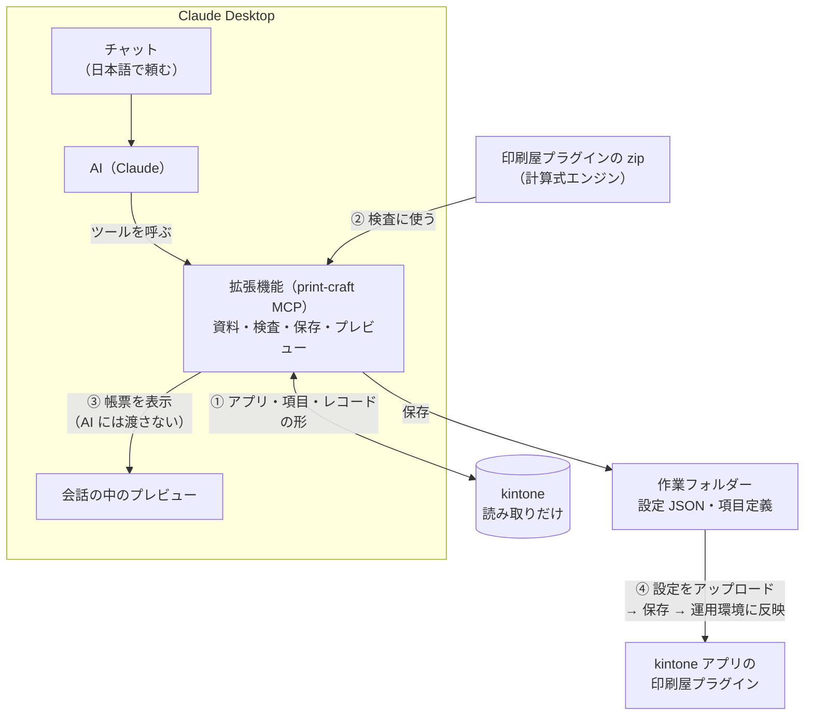

<!--
title: rex0220 印刷屋プラグイン - AI(Claude Desktop)に帳票を作らせる（チャットだけで）
tags:
  - kintone
  - プラグイン
  - 帳票
  - MCP
  - Claude
private: true
-->

<!--
公開の前に確かめること（このコメントは Qiita では表示されません）:
- 拡張機能の配布の URL とファイル名（GitHub のリリース。リポジトリを public にした後。B3）
- Windows の Claude Desktop で手順を確かめる（今は macOS だけ）。確かめたら「前提」の文と「つまずいたら」を直す
- 画像を差し込む: 会話の中のプレビュー、拡張機能のインストールと設定の画面、ツールの許可の確認、kintone の API トークンの画面
- Claude Desktop の画面の名前（設定 → 拡張機能 など）が、その時の版と合っているか
- 「AI の返答」を、公開する版の実際の返答に差し替えるか
- 「作った後」の頼み方の例（1 行おきのグレー、有効期限、備考の欄）を実際に試して、うまくいくものだけを載せる
- MCP Apps に対応した Claude Desktop の版が分かれば、「新しい版にしておいて」の注意に書く
-->

kintone の帳票（PDF）を、**Claude Desktop のチャットで頼むだけで** AI に作らせる拡張機能「印刷屋 設定オーサリング（Print craft）」を公開しました。ターミナルやプログラミングは要りません。

```
印刷屋で見積書の帳票を作りたい。アプリは 3740。
A4 縦で、宛名（御中）、見積番号、発行日、明細の表と小計・消費税・合計。
PDF は添付ファイル項目「見積ファイル」に保存。
```

これだけで、AI が**アプリの項目定義とレコードの形を確かめながら**帳票の HTML・CSS・計算式を組み、検査を通した設定 JSON を作業フォルダーに保存します。帳票は**会話の中にプレビューとして表示**されるので、その場で見た目を確かめてから、印刷屋プラグインの設定画面でアップロードして保存するだけです。

会話の中に表示された帳票のプレビュー

<!-- 画像: 会話の中のプレビュー（見積書） -->

**拡張機能（GitHub）**: https://github.com/rex0220/print-craft-authoring-mcp

> プラグイン本体の機能は **[製品紹介記事](https://qiita.com/rex0220/items/9be2d9b20a3a1f016c76)** と **[FAQ](https://qiita.com/rex0220/items/a866440c50c1028acb4f)** を、帳票を設定画面で作る手順は **[見積書の作成手順](https://qiita.com/rex0220/items/9df2dd382ee86385bb8d)** を参照してください。
> Claude Code（VSCode）で作る方法は **[AI(Claude Code)に帳票を作らせる](https://qiita.com/rex0220/items/0ce0afc9405bdc39013b)** にあります。本記事は Claude Desktop のチャットで作る方法に絞ります。
>
> どちらを使うかの目安です。
> - **Claude Desktop（本記事）**: チャットと画面の操作だけで作りたい方。帳票は会話の中で確かめられます
> - **Claude Code**: ターミナルに慣れていて、git での履歴管理やスクリプトと組み合わせて、大きな帳票を作り込みたい方

---

# 仕組み

印刷屋プラグイン Ver.6 の設定は、設定画面の**設定のダウンロード / アップロード**で、JSON のファイルとしてまるごと受け渡しできます。拡張機能（print-craft MCP）は、AI がこの JSON を書くための道具と資料を、Claude Desktop に足すものです。



ポイントは 4 つです。

- **①** AI は拡張機能のツールで、アプリの項目コードと型、レコードの**形**（明細の行数、文字数など）を確かめてから帳票を組み、**要件の言葉と項目コードの対応を表で示します**。kintone には読み取りしか送りません
- **②** 保存の前に、**手元の印刷屋プラグインの zip の計算式エンジン**で設定を検査します。エラーが 0 になるまで AI が直します
- **③** 帳票は**会話の中にそのまま表示**されます。帳票に入ったレコードの値（宛名など）は表示にだけ渡り、AI には渡りません
- **④** できた設定は作業フォルダーにファイルとして残るので、設定画面でアップロードするだけです

---

# 前提

| 項目 | 本記事の前提 |
| :--- | :--- |
| プラグイン | 印刷屋プラグイン **Ver.6 以降**（製品版または試用版）。アプリに入れたものと同じ版の **zip ファイルを手元に置く** |
| Claude Desktop | **[Claude Desktop](https://claude.com/download)**（Claude のサブスクリプション）。拡張機能を動かすための Node.js などを、別に入れる必要はありません |
| 拡張機能 | 印刷屋 設定オーサリング（Print craft）（`.mcpb` ファイル） |
| kintone | 対象アプリの**レコード閲覧だけの API トークン**（おすすめ）。またはログイン名とパスワード（**2 要素認証なし**のアカウント） |
| 対象アプリ | 記事の例は見積書アプリ（アプリ番号 3740。見積明細のテーブル、小計・消費税・合計の計算項目、添付ファイル項目「見積ファイル」がある） |

本記事の手順は、macOS の Claude Desktop と、拡張機能 0.1.0〜0.1.3 で確かめました。

> AI（Claude）が読んだ項目定義とレコードの形は、Claude の処理に使われます。レコードの**値**は、拡張機能のツールが AI に返しません（後述の「安全のしくみ」）。

---

# 準備（初回だけ）

## 1. 拡張機能を入れる

[GitHub のリリース](https://github.com/rex0220/print-craft-authoring-mcp/releases) から拡張機能のファイル（`.mcpb`）をダウンロードして、ダブルクリックします。インストールの画面が出たら、**インストール** を選びます。

ダブルクリックで Claude Desktop が開かないときは、Claude Desktop の **設定 → 拡張機能** の画面に、ファイルをドラッグして入れます。

<!-- 画像: 拡張機能のインストールの画面 -->

> Claude Desktop は、新しい版にしておいてください。会話の中に帳票を表示する部品（MCP Apps）に対応していない古い版では、プレビューが会話に出ません（そのときは、AI が返す `out/` の HTML を Chrome で開きます）。

## 2. 作業フォルダーを決める

帳票の設定や項目定義を置くフォルダーを 1 つ決めます（例: 書類フォルダーの中の `print-craft`）。無ければ拡張機能が作ります。

## 3. kintone の接続のファイルを書く

kintone の接続先と認証は、**接続のファイル**（JSON）に書きます。**作業フォルダーの外**に置きます（例: ホームフォルダーの `print-craft-kintone.json`）。

まず、対象アプリの API トークンを作ります。

1. アプリの設定 →「設定」タブ →「カスタマイズ/サービス連携」の **API トークン**
2. **生成する** を押し、アクセス権は **レコード閲覧** だけに印を付ける
3. **保存** → **アプリを更新**

<!-- 画像: API トークンの画面（レコード閲覧だけ） -->

接続のファイルの例です（`<…>` を自分の値に書き換えます）。

```json
{
  "defaultProfile": "dev",
  "profiles": {
    "dev": {
      "baseUrl": "https://<自分の環境>.cybozu.com",
      "tokenMap": { "APP3740": "<アプリ 3740 の API トークン>" }
    }
  }
}
```

- `tokenMap` には、アプリごとにトークンを書きます（`APP` + アプリ番号）。アプリを足すときは、`"APP3741": "…"` のように足します
- ログイン名とパスワードで使うなら、`tokenMap` の代わりに `"auth": "userpass", "username": "<ログイン名>", "password": "<パスワード>"` と書きます
- ファイルには秘密の値が入るので、ほかの人が読めない場所（自分のユーザーのフォルダーの中）に置き、人と共有するフォルダーには置きません。Mac なら、ターミナルで `chmod 600 ~/print-craft-kintone.json` とすると自分だけが読めるようになります

> 形は kSQL（kintone の SQL ツール）の `ksql.config.json` と同じなので、kSQL のファイルをそのまま指すこともできます。ただし、書き込みにも使うトークンは共有せず、印刷屋用にはレコード閲覧だけのトークンを使ってください。

## 4. 拡張機能を設定する

Claude Desktop の **設定 → 拡張機能 → 印刷屋 設定オーサリング（Print craft）** で、3 つを選びます。

| 設定項目 | 選ぶもの |
| :--- | :--- |
| 作業フォルダー | 手順 2 のフォルダー |
| 印刷屋プラグインの zip | アプリに入れたものと同じ版の zip |
| kintone の接続のファイル | 手順 3 のファイル |

<!-- 画像: 拡張機能の設定の画面 -->

フォルダーとファイルは選ぶ画面で選べるので、パスを打ち込む必要はありません。選んだら、**Claude Desktop を終了して起動し直します**（設定を変えたときも同じです）。

## 5. 疎通確認

新しいチャットで頼みます。

```
印刷屋の準備ができているか確かめて
```

AI が拡張機能のツールを呼び、拡張機能の版、印刷屋の zip の版、kintone の接続先と使えるかどうかを返せば、準備完了です。

ツールを初めて使うときは、使ってよいかの確認が出ます（Claude Desktop の決まりです）。内容を見て **常に許可** を選ぶと、次から聞かれません。

<!-- 画像: ツールの許可の確認 -->

> 拡張機能が書き込むのは作業フォルダーの中だけで、kintone には読み取りしか送りません。

---

# 作らせる

## 事前準備（手作業）

拡張機能は kintone を変更しないので、次は人が済ませておきます。

- 対象アプリに印刷屋プラグイン（Ver.6 以降）を追加する
- PDF を添付ファイル項目に保存するなら、その項目をアプリに作っておく

## 頼む

冒頭のように、チャットで頼みます。コツは 3 つです。

- **「印刷屋で」と付けて**頼む。拡張機能のツールを使ってほしい、という合図になります
- **アプリは番号か URL で**伝える（アプリの URL の `/k/番号/` の数字。詳細画面の URL を貼ってもかまいません）。同じ名前のアプリの取り違えを防ぎます
- **用紙と向き**、**ボタンを押したときの動き**（プレビューを表示 / 確認してから作成 / すぐに作成）、**保存先**（添付ファイル項目か、ダウンロードか）を伝える。決まっていなければ、AI が見積書の雛形の形で作るので、あとから直せます

AI は、おおむねこう動きます（ツールの呼び出しは自動です）。

1. 手順の資料を読み、準備ができているかを確かめる
2. アプリの名前を確かめ、項目定義を取る（作業フォルダーに `kintone/dev/3740-見積書(印刷屋)/` のような、アプリのフォルダーができます）
3. プレビューに使うレコードを選び、その**形だけ**を取る（明細の行数、文字数など。値は AI に返りません）
4. 帳票の設定を書き、検査を通して保存する（エラーが 0 になるまで直す）
5. 帳票をプレビューして、会話の中に表示する

## AI の返答

終わると、AI はこう返してきます（実際の返答の抜粋。作業フォルダーの見積書の設定を、レコード 3 で試し出力したとき）。

> **試し出力の結果**：1 ページ、式のエラー 0。会話の中のプレビューに表示されているはずです（出ない場合は `kintone/dev/3740-見積書(印刷屋)/out/見積書.html` を Chrome で開いてください）。
>
> 検査で出た指摘はそのままお伝えします。
> - 警告（formula.rawHtml）：`TABLE_HTML` の結果がそのまま帳票の HTML になる。外部読み込みとスクリプトは印刷屋が除くが、崩れは防げないので差分で人が確認を
> - 情報：保存値 2,393 bytes / 上限 262,144（1%）
>
> **今の帳票の中身**
> - 本文：宛名「御中」、見積金額（合計）、有効期限（見積日 + 1 か月）、見積番号・発行日、発行元「株式会社サンプル」＋担当者＋角印（SVG のダミー）
> - 明細：`見積明細` を `TABLE_HTML` で ＃・商品名・数量・単価・金額（型番は出していません）
> - 下部：備考（改行を `<br>` に）、小計・消費税 (10%)・合計
> - ボタン：詳細画面＋一覧の一括処理、A4 縦、押したとき確認、ファイル名「見積書-<見積番号>.pdf」、保存先 `見積ファイル`
> - 表示条件 `NOT(見積ファイル)`：**レコード 3 はすでに見積ファイルが添付されているので、実機ではこのボタンが出ません**

要件の言葉に対応する項目が無いもの（発行元の社名など）は、仮の値を明示して確認を求めてきます。答えるときは、後述の「作った後 — 変更もチャットで頼む」と同じ頼み方です。

警告 `formula.rawHtml` は、明細のセルの値（商品名など）がエスケープされずに HTML として入る、という意味です。検査が見るのは設定の HTML と計算式で、差し込まれるレコードの値までは見ません。商品名などに `<` や `&` が入りうるなら、そういうデータでも PDF を確かめてください。

## 見た目を確かめる

帳票は、拡張機能の表示の部品（MCP Apps）で、**会話の中に帳票のカードとして**開きます。ページが縦に並び、会話の幅に合わせて縮めて表示されます。カードの右上の **全画面** で大きく見られます。

<!-- 画像: 会話の中のプレビュー（全画面） -->

- 近似のプレビューです。添付ファイルの画像と QR はダミーで、Web フォントは読みません（その書体が PC に入っていなければ、OS の書体で表示されます）。最終的な見た目は、印刷屋プラグインの PDF で確かめます
- **AI はプレビューの見た目を見ていません。** 崩れを直してほしいときは言葉で伝えるか、プレビューのスクリーンショットを撮ってチャットに貼ってください。貼った画像には帳票の値が写るので、AI に渡してよいかを確かめてから貼ります
- 表示されないときは、AI が返す `out/〇〇.html` を Chrome で開きます

## 取り込む

1. アプリの設定 → プラグイン → 印刷屋プラグインの **設定**
2. **設定をアップロード** で、作業フォルダーの設定のファイルを選ぶ（例 `kintone/dev/3740-見積書(印刷屋)/見積書.json`。場所は AI の返答に出ています）
3. **取り込み方**を選ぶ
   - 印刷屋の設定がまだ無いアプリ → **全置換**
   - 既にボタンがあるアプリに足す → **追加**
   - 既にあるボタンを差し替える → **一部置換**（ボタンごとに置き換え先を選ぶ）
4. **保存する** → **運用環境に反映**

設定のアップロード — 取り込み方を選ぶ


取り込んだボタンに、このアプリで使えない設定（無い項目など）があると、保存のときにエラーになり保存されません。

詳細画面にボタンが出るので、押して PDF を確かめます。見た目、改行、ファイル名、保存先を見てください。

---

# 作った後 — 変更もチャットで頼む

2 回目からは、「**どの帳票か + 変更内容**」の形で頼みます。

```
印刷屋の見積書の発行元を「株式会社〇〇」に変えて、明細の表に型番の列を足して
```

見た目や書式の直しも、同じように言葉で頼めます。たとえば:

```
明細の表を 1 行おきに薄いグレーにして
```

```
有効期限を見積日の 2 週間後にして
```

```
備考が空のときは、備考の欄を出さないで
```

- AI は同じファイルを直し、保存の前に検査します。「差分を見せて」と頼めば、変更前との違いを確かめられます。確かめてから「一部置換」で取り込みます
- 設定画面で直した設定を AI に直させるときは、設定画面の **設定をダウンロード** で落としたファイルを、作業フォルダーの `inbox/` に置いて「印刷屋で取り込んで」と頼みます

---

# 安全のしくみ

帳票の HTML はレコードの値と混ざって描かれるので、拡張機能は次のように守っています。

- **kintone は読み取りだけ**: 拡張機能が kintone に送るのは読み取り（GET）だけです。設定の反映は、人が設定画面で行います
- **書くのは作業フォルダーの中だけ**: 保存するのは検査を通した設定だけで、同じ名前のファイルは上書きしません（直すときは差し替えのツールを使います）。設定画面からダウンロードしたファイルは書き換えません
- **秘密の値は出さない**: API トークンやパスワードは、AI への応答にもログにも出しません。接続のファイルを読むのは拡張機能だけで、AI はファイルの中身を読めません（ファイルを扱うほかの拡張機能を同じ Claude Desktop で有効にしているときは除きます）
- **レコードの値は AI に渡さない**: レコードは形（行数・文字数など）だけを AI に返します。プレビューの帳票は表示にだけ渡り、AI には渡りません（AI に帳票の宛名を聞いても答えられません）。スクリーンショットを貼ったときは、写った値が AI に渡ります
- **プレビューは閉じた箱**: 帳票は、外部と通信しない枠の中で表示します。スクリプトも外部からの読み込みも止めるので、レコードの値にタグやスタイルを仕込んでも、外へは何も送れません
- **許可したものだけ**: 検査は許可した要素と属性だけを通し、スクリプト、イベント属性、`javascript:` の URL などはエラーで止めます。新しい設定は外部参照を「除く」にするので、印刷屋 Ver.6 が描画の前に kintone 以外への読み込みとスクリプトを除きます
- **zip の確認**: 拡張機能は、zip のプラグイン ID が印刷屋のものでなければ、zip のコードを動かしません。署名までは確かめないので、zip は配布元から入手したものだけを使ってください

サーバー側からも書き込みを防ぐため、**レコード閲覧だけの API トークン**を使ってください。

---

# つまずいたら

| 症状 | 確認すること |
| :--- | :--- |
| AI が「準備ができていない」と言う | 拡張機能の設定の 3 項目（作業フォルダー・zip・接続のファイル）。設定を変えたら **Claude Desktop を終了して起動し直す** |
| ツールの許可の確認が何度も出る | 確認の画面で **常に許可** を選ぶ。Claude Desktop の設定のツールの権限で、まとめて決めることもできます |
| AI が拡張機能を使わずに答える | **「印刷屋で」と付けて**頼む。新しいチャットで頼み直す |
| kintone の情報が取れない | 接続のファイルの `baseUrl`、`tokenMap` のアプリ番号（`APP3740` の形）、トークンのアクセス権（レコード閲覧）、トークンを作った後に **アプリを更新** したか |
| 401 / 権限エラー（ログイン名とパスワード） | ログイン名・パスワードの誤り。**2 要素認証が有効なアカウントは使えません**。そのユーザーにアプリの閲覧権限があるか |
| 印刷屋の zip のエラー | 拡張機能の設定の zip が、アプリに入れたものと同じ版（Ver.6 以降）の印刷屋の zip か |
| プレビューが表示されない | AI が返す `out/〇〇.html` を Chrome で開く |
| 同じ名前で保存できない | 上書きしない作りです。直すときは「〇〇を直して」と頼む（差し替えのツールで直します） |
| ボタンが出ない | 表示条件（例: 見積ファイルが空のときだけ出す）。添付済みのレコードでは出ません |
| 2 ページ目の下が切れる | 1 ページは用紙に固定で、はみ出した分は切れます。明細が多いなら「表を複数ページに分けて」と頼む |

---

# まとめ

- **チャットで頼み、会話の中で確かめ、設定画面で取り込む。** AI はアプリの項目とレコードの形を確かめて設定を書き、拡張機能が検査とプレビューをします
- kintone には読み取りだけ。レコードの値は AI に渡しません
- 拡張機能: https://github.com/rex0220/print-craft-authoring-mcp
- Claude Code（VSCode）で作る方法: [rex0220 印刷屋プラグイン - AI(Claude Code)に帳票を作らせる](https://qiita.com/rex0220/items/0ce0afc9405bdc39013b)
- プラグインの機能全般は [製品紹介記事](https://qiita.com/rex0220/items/9be2d9b20a3a1f016c76)、よくある質問は [FAQ](https://qiita.com/rex0220/items/a866440c50c1028acb4f) へ
